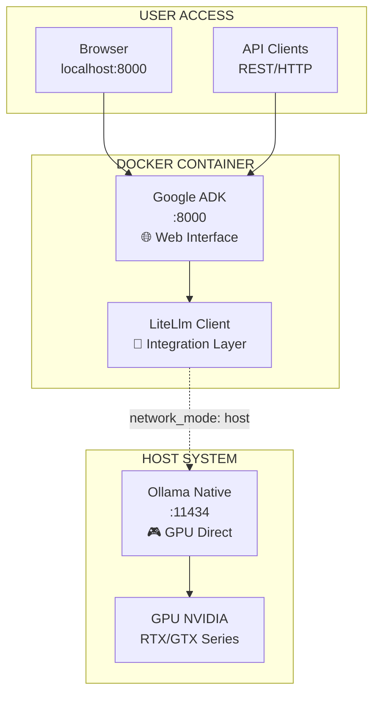

# Demo Ollama + Google ADK 🚀

**Integración híbrida de Google ADK con Ollama para aplicaciones de IA conversacional**

[](https://python.org)
[](https://github.com/google/adk)
[](https://docker.com)
[](https://ollama.ai)

---

## � Descripción

Este proyecto demuestra cómo integrar **Google ADK** (Agent Development Kit) con **Ollama** para crear aplicaciones conversacionales avanzadas que combinan lo mejor de ambos mundos:

- 🦙 **Ollama nativo**: Máximo rendimiento de GPU para inferencia local
- 🏗️ **Google ADK containerizado**: Entorno reproducible y escalable  
- 🔄 **Arquitectura híbrida**: Simplicidad operacional con performance optimizada

### 🎯 Características Principales

- ✅ **Interfaz Web Completa**: Dashboard web accesible en `http://localhost:8000`
- ✅ **GPU Acceleration**: Soporte nativo para NVIDIA RTX/GTX 
- ✅ **Docker Ready**: Despliegue con un solo comando
- ✅ **LiteLlm Integration**: Conectividad transparente con modelos Ollama
- ✅ **Environment Management**: Configuración por variables de entorno
- ✅ **Production Ready**: Arquitectura escalable y mantenible

---

## 🚀 Quick Start

### Requisitos Previos

```bash
# Sistema requerido
- Linux/Windows/MacOS
- Python 3.11+
- Docker & Docker Compose
- GPU NVIDIA (opcional, recomendado)
- 8GB RAM mínimo, 16GB recomendado
```

### Instalación Rápida

1. **Clonar el repositorio:**
```bash
git clone https://github.com/tu-usuario/demo-ollama.git
cd demo-ollama
```

2. **Instalar Ollama (nativo):**
```bash
# Linux/MacOS
curl -fsSL https://ollama.ai/install.sh | sh

# Windows: Descargar desde https://ollama.ai/
```

3. **Descargar modelo recomendado:**
```bash
ollama pull qwen3:8b
```

4. **Configurar entorno:**
```bash
# Copiar configuración de ejemplo
cp chat_agent/.env.example chat_agent/.env

# Editar variables si es necesario (opcional)
# OLLAMA_API_BASE="http://localhost:11434"
```

5. **Ejecutar aplicación:**
```bash
# Un solo comando para todo
docker compose up --build -d

# Verificar que todo funciona
curl http://localhost:11434/  # Ollama API
curl http://localhost:8000/   # Google ADK Web
```

### 🌐 Acceso a la Aplicación

- **Web Interface**: http://localhost:8000
- **API Documentation**: http://localhost:8000/docs  
- **Ollama API**: http://localhost:11434

---

## 🏗️ Arquitectura

### Modelo Híbrido



### Ventajas del Diseño

| Componente | Ubicación | Beneficios |
|------------|-----------|------------|
| **Ollama** | Nativo | 🚀 GPU directa, máximo rendimiento |
| **Google ADK** | Docker | 📦 Reproducible, fácil distribución |
| **Networking** | Host mode | 🔗 Conectividad simplificada |

---

## 📊 Performance y Especificaciones

### Hardware Testado

- **GPU**: NVIDIA RTX 4060 (8GB VRAM)
- **RAM**: 32GB DDR4
- **CPU**: AMD/Intel moderno
- **Storage**: SSD recomendado para modelos

### Benchmarks

| Modelo | Tamaño | VRAM Usado | Tiempo Respuesta | Throughput |
|--------|--------|------------|------------------|------------|
| qwen3:8b | 5.2GB | ~5.7GB | <3s | ~15 tokens/s |
| llama3:8b | 4.7GB | ~5.2GB | <3s | ~18 tokens/s |
| gemma3:4b | 3.3GB | ~3.8GB | <2s | ~25 tokens/s |

---

## 🛠️ Configuración Avanzada

### Variables de Entorno

```bash
# chat_agent/.env
OLLAMA_API_BASE="http://localhost:11434"      # URL de Ollama
OLLAMA_BASE_URL="http://localhost:11434"      # URL alternativa
ADK_LOG_LEVEL="INFO"                          # Nivel de logs
ADK_HOST="0.0.0.0"                           # Host para ADK web
ADK_PORT="8000"                              # Puerto para ADK web
```

### Modelos Soportados

```bash
# Instalar modelos adicionales
ollama pull llama3:8b          # Modelo LLaMA 3
ollama pull gemma3:4b          # Modelo Gemma más ligero
ollama pull qwen3:8b           # Modelo Qwen (recomendado)
ollama pull codellama:7b       # Especializado en código

# Listar modelos disponibles
ollama list
```

### Personalización del Agente

```python
# chat_agent/agent.py
from google.adk.agents import Agent
from google.adk.models.lite_llm import LiteLlm

root_agent = Agent(
    name="mi_agente_personalizado",
    description="Descripción del agente",
    model=LiteLlm(
        model="ollama_chat/tu_modelo_favorito",
        api_base="http://localhost:11434",
        temperature=0.7,           # Creatividad
        max_tokens=512,           # Tokens máximos
    ),
    # Agregar más configuraciones...
)
```

---

## 📖 Comandos Útiles

### Desarrollo

```bash
# Activar entorno Python local (desarrollo)
source .venv/bin/activate
uv sync

# Ejecutar agente localmente
uv run python chat_agent/agent.py

# Instalar dependencias nuevas
uv add nueva-libreria
```

### Docker

```bash
# Reconstruir servicios
docker compose up --build

# Ver logs en tiempo real
docker compose logs -f adk

# Detener servicios
docker compose down

# Limpiar todo (cuidado!)
docker compose down -v --rmi all
```

### Ollama

```bash
# Gestión de modelos
ollama list                    # Ver modelos instalados
ollama pull modelo:tag         # Descargar modelo
ollama rm modelo:tag           # Eliminar modelo
ollama run modelo "prompt"     # Test directo

# Monitoreo
ollama ps                      # Modelos en memoria
nvidia-smi                     # Estado GPU
```

### Debugging

```bash
# Test de conectividad
curl http://localhost:11434/api/tags      # API Ollama
curl http://localhost:8000/health        # Health check ADK

# Test de generación
curl -X POST http://localhost:11434/api/generate \
  -H "Content-Type: application/json" \
  -d '{"model":"qwen3:8b","prompt":"Hello world","stream":false}'
```

---

## 🗺️ Roadmap y Planes Futuros

### 🎯 Versión 2.0 (Q4 2025)

- [ ] **Multi-Agent System**: Múltiples agentes especializados
- [ ] **RAG Integration**: Búsqueda en documentos locales
- [ ] **Memory Management**: Persistencia de conversaciones
- [ ] **Plugin Architecture**: Sistema de plugins extensible
- [ ] **Web UI Redesign**: Interfaz moderna - **Frontend Python** (Reflex/FastHTML/Streamlit - Pendiente decisión comunitaria)

### 🎯 Versión 2.5 (Q1 2026)

- [ ] **Kubernetes Support**: Despliegue en K8s
- [ ] **Horizontal Scaling**: Load balancing entre instancias
- [ ] **Model Switching**: Cambio dinámico de modelos
- [ ] **API Gateway**: Rate limiting y autenticación
- [ ] **Monitoring Stack**: Prometheus + Grafana

### 🎯 Versión 3.0 (Q2 2026)

- [ ] **Cloud Integration**: AWS/GCP/Azure deployment
- [ ] **Edge Computing**: Optimización para edge devices
- [ ] **Fine-tuning Pipeline**: Entrenamiento de modelos custom
- [ ] **Multi-modal Support**: Imágenes, audio, video
- [ ] **Enterprise Features**: SSO, audit logs, compliance

### 💡 Ideas en Exploración

- **Frontend Python**: Evaluación de Reflex vs FastHTML vs Streamlit para UI moderna
- **Voice Interface**: Integración con speech-to-text
- **Mobile App**: Cliente móvil para iOS/Android  
- **Browser Extension**: Plugin para navegadores
- **IDE Integration**: Extensiones para VSCode, IntelliJ
- **Workflow Automation**: Zapier/n8n integrations

### 🐍 **Decisión de Stack Frontend**

**¿Por qué Reflex en lugar de React/Vue?**

| Aspecto | Reflex | React/Vue |
|---------|--------|-----------|
| **Lenguaje** | 🟢 Python puro | 🔴 JavaScript/TypeScript |
| **Curva de aprendizaje** | 🟢 Familiar para Python devs | 🔴 Requiere aprender JS ecosystem |
| **Integración** | 🟢 Nativa con backend Python | 🟡 API REST/GraphQL |
| **Type Safety** | 🟢 Python typing nativo | 🟡 TypeScript requerido |
| **Performance** | 🟡 Buena para la mayoría de casos | 🟢 Excelente |
| **Ecosistema** | 🔴 Pequeño pero creciente | 🟢 Maduro y extenso |
| **Desarrollo** | 🟢 Un solo language stack | 🔴 Frontend + Backend separados |

**Veredicto**: Para este proyecto, **Reflex** ofrece la mejor relación simplicidad/funcionalidad manteniendo la coherencia del stack Python.

---

## 🤝 Contribuciones

¡Las contribuciones son bienvenidas! Por favor:

1. **Fork** el repositorio
2. **Crear** branch para feature (`git checkout -b feature/nueva-caracteristica`)
3. **Commit** cambios (`git commit -am 'Añadir nueva característica'`)
4. **Push** al branch (`git push origin feature/nueva-caracteristica`)
5. **Abrir** Pull Request

### 🐛 Reportar Issues

- Usar plantillas de issue para bugs y features
- Incluir logs y configuración del sistema
- Especificar versiones de dependencias

---

## 📄 Licencia

Este proyecto está licenciado bajo la **MIT License** - ver el archivo [LICENSE](LICENSE) para más detalles.

---

## 🙏 Agradecimientos

- **Google ADK Team** - Por las herramientas de desarrollo de agentes
- **Ollama Community** - Por el framework de modelos locales
- **LiteLlm Team** - Por la capa de abstracción de modelos
- **Open Source Community** - Por las librerías que hacen esto posible

---

## 📞 Soporte

- **Documentación**: [PROCEDIMIENTO.md](PROCEDIMIENTO.md) para detalles técnicos
- **Issues**: [GitHub Issues](../../issues) para bugs y features  
- **Wiki**: [GitHub Wiki](../../wiki) para guías adicionales
- **Discussions**: [GitHub Discussions](../../discussions) para preguntas

---

## 🏷️ Tags

`ollama` `google-adk` `ai` `chatbot` `python` `docker` `gpu` `nvidia` `llm` `local-ai` `conversational-ai` `agent-development`

---

*Desarrollado con ❤️ para la comunidad de IA open source*
